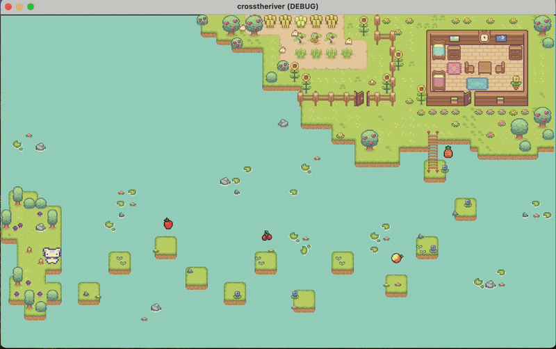

# 🏝️ ***MochiGo!***

**A 2D educational game built with Godot. The player helps *Mochi* trapped on an island cross a river by solving arithmetic questions. Each correct answer lets the player jump forward on stones; a wrong answer sends them back. Reach the shore before time runs out!**

---

## 🖼️ Gameplay Preview

---

## 🎮 Features

- Adorable Cartoon-Style, kid-friendly appeal scenes
- arithmetic questions cover all grade in primary school math
- Real-time question answering with forward/backward jumping logic
- Time limit challenge
- Cute rewards and cheerful challenges make every playtime an exciting adventure!
---

## 🛠️ Technologies

- **Engine:** Godot 4.x
- **Language:** GDScript
- **Assets:** Custom and free 2D sprites
- **Version Control:** GitLab

---

## 📦 How to Run

1. Open the project with Godot 4.x
2. Run the main scene (`main.tscn`)
3. Enjoy solving math and escaping the island!

---

## 📌 Credits

- Team: Dream
- Members: Dmytro, Hasandi, Ruijia, Shiyin, Simin
- Inspired by real-world classroom learning needs
- Assets from <https://cupnooble.itch.io/sprout-lands-asset-pack>

---

## 📣 License

MIT
