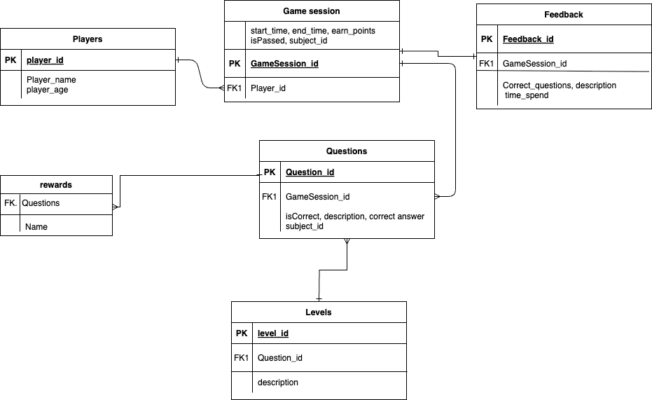
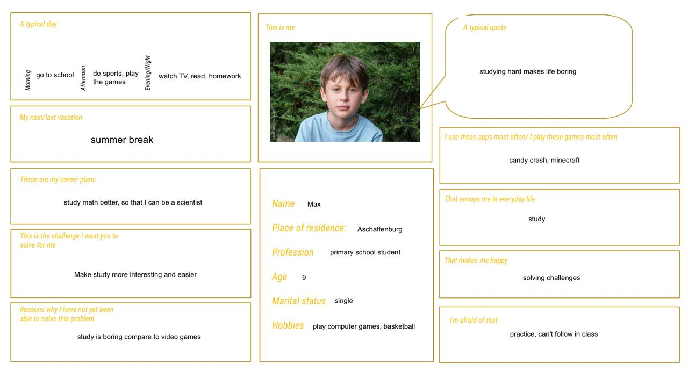
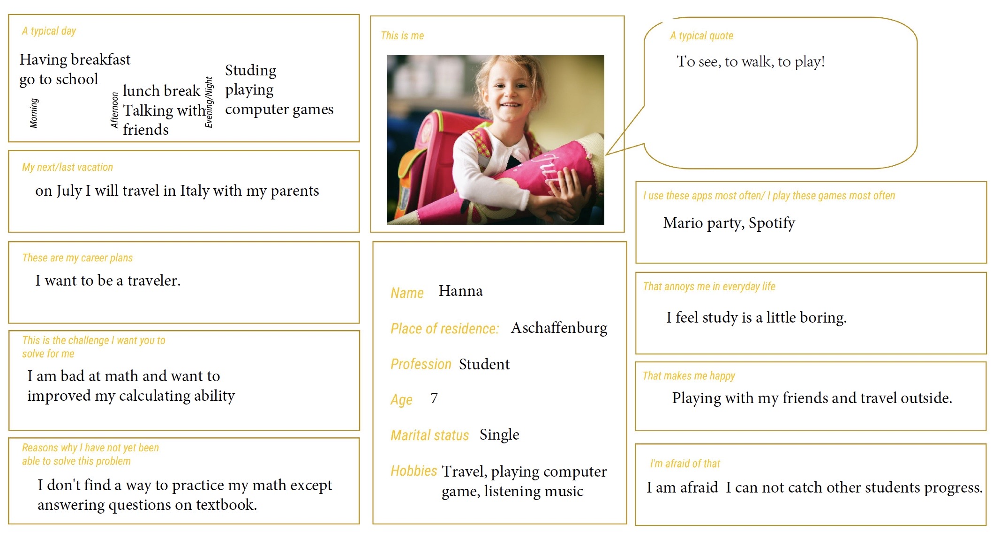
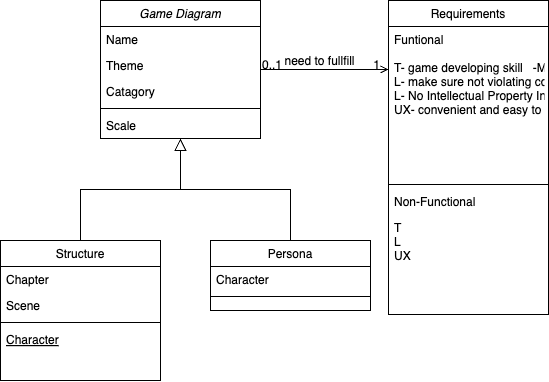

# Tasks 02 – Requirements
*Objectives: Do some requirementsnengineering*
### 1 – Use case diagram and descriptions  

Use case diagram:

|**Field**| **Description**|
|---------------|-----------------------------------|
|Name| Pasing the tasks and gain rewards in game|
|Short description|This use case describes the entire procedure from identification of a player playing the game and gaining rewards.|
|actors|player, game system|
|Pre-conditions|The player have download the game and have basic primary math knowledges|
|Trigger|Players enter the game menu and start game|
|Main Scenario|1.Players enter the game map and select a special level based on their background. 2.The system generated math questions 3. Players answer the questions  4. System judge the answer 5.System show next questions 6. The player arrived on the shore within the time limit. 7. The player succeed. 8.The system will save players’ playing progress. 9..Use case completed|
|Alternative Scenatio|4a1. Players answer the question correctly &emsp;&emsp;4a1.1: Players takes one step forward and get rewards &emsp;&emsp;4a1.2: Continue with 5 4a2. Players do not answer the question correctly &emsp;&emsp;4a2.1 System show the correct answer and Players jump back one step. &emsp;&emsp;4a2.2 Continue with 5 6a. 1: Player doesn’t arrive on the shore within the limited time. 6a. 2: The player loses. Continue with 8.|
|Post-condition|Main Scenario: Players have basic math knowledge and want to practice math.|
|

### 2 - Domain data

### 3 – Context analysis – Project Idea
**Project Name:** "MochiGo!"

**Goal of the Game:**
Help a character escape from a island by solving arithmetic questions correctly and quickly. The player must jump across stones in a river to reach the shore. Each stone represents a math challenge. Right answers move the player forward, wrong ones send them back.

**Core Concept:**
Setting: Trapped island with a river and 12 stepping stones. Objective: Reach the opposite shore within a time limit. Mechanics: Solve a math question → correct = jump forward, wrong = jump backward. Timer adds urgency. Educational, fun, and challenging.

**Inspiration / Creativity Techniques Used:**

SCAMPER:

Substitute: Replace boring drills with interactive jumping game.
 Adapt: Classic quiz games adapted into a 2D adventure.
 Modify: Timer adds challenge pressure.
 Put to another use: Use basic math tasks for primary students.
 Eliminate: No complicated puzzles — just quick math.
 Reverse: Wrong answer = punishment (jumping backward).

### 4 – Context analysis – Vision, Personas
**Project Vision**

To make learning math an adventure by combining engaging gameplay with educational challenges, with particular focus on improving mental arithmetic questions for primary school students.

**Personas**

### 5 - Context Analysis - Dictionary of terms
**Player** – The character the user controls; moves, jumps, and reacts to correct answers. 
**Entity** – Any thing in the game world, like a player, enemy, or item. 
**System** – A script or group of logic that handles a specific function, like movement or answer checking. 
**Scene** – A saved collection of nodes (like characters, UI, or full levels). 
**Level** – A full playable area or screen; often just a scene that contains the game setup. 
**UI** – On-screen elements like text, buttons, and input boxes; not part of the physical world. 
**Game Loop** – The constant cycle where the game checks input, updates logic, and shows results. 
**Event** – A trigger, like pressing a button or typing, that causes something to happen. 
**Feedback** – Visual/text responses (like “Correct!” or “Try again”) to tell the player what happened. 
**Interaction** – Any action the player performs, like moving or typing an answer. 
**Input Handling** – The system that checks what keys or buttons the player is using. 
**Game State** – The current mode of the game (waiting, checking, moving, etc). 
**Spawn / Instance** – When the game creates something (like a player or question panel) in the scene. 
**World** – The physical game space where the player moves around. 
**Timer** – A delay used to pause between actions, like waiting after a correct answer.

### 5 – Context analysis – Quantity Structure
Knowing the size of the project helps estimate workload, plan development stages, and manage resources. 

Key figures for my game include: 4 difficulty-levels, corresponding to primary grades, 12 interactive steps (stones), 1 main character, 1 gameplay scene, 100+ arithmetic questions, 100-second time limit, and multiple animations for user feedback.

### 5 - Context Analysis - Current State Analysis
|**Similar Game**| **Likes** | **Dislikes** |
|--------|----------|-------------|
|Prodigy| Integrates learning with RPG progress, feels like a game .| Slow for fast-paced learners. Requires accounts. Too much focus on dialogues.|
|Geometry Dash|Satisfying controls and rhythm-based jumps.| No learning. Too hard for younger players.|
|MathLand|Rewards progress with exploration of the island.| Not much challenge in gameplay.|
|

### 6 – List of Requirements
FR： 
T- game developing skill   -Must 
L- make sure not violating commercial law -Must   
L- No Intellectual Property Infringement -M 
UX- convenient and easy to use -C  

NFR： 
Q- attracting and appealing for children -C 
A- public and popularity -C

### 7 – Prioritization of non-functional requirements
Prioritization of NFR：
Q- attracting and appealing for children -C

Finish the "UX- convenient and easy to use -C" in FR, in order to be more user friendly.

### 8 – UML Behavior Diagrams

